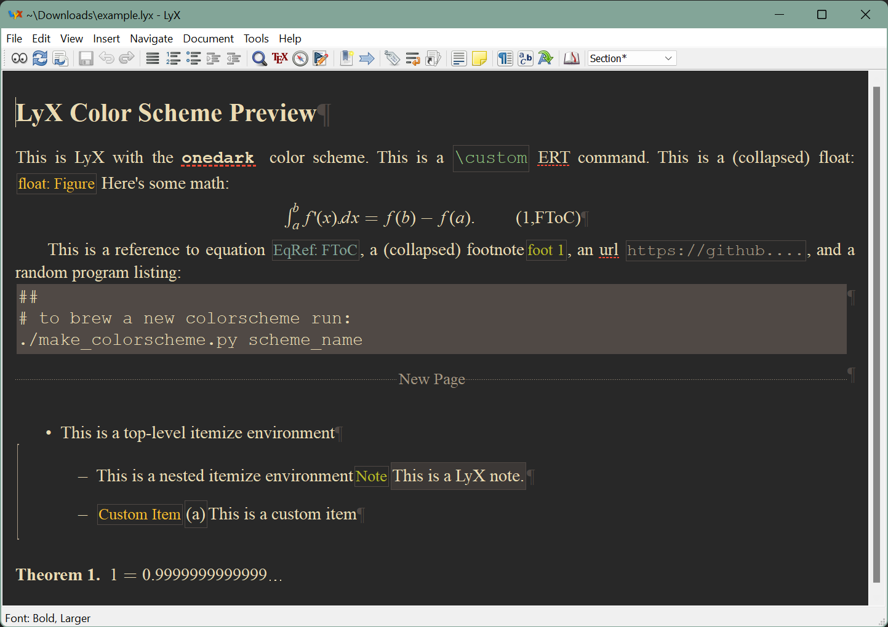

# gruvbox.lyx

<a href="img/gruvbox.png"></a>

A dark LyX color scheme with colors inspired by the excellent [Gruvbox color
theme](https://github.com/morhetz/gruvbox) for the [Vim
text editor](https://www.vim.org).

## Installation

1. Install the theme by replacing the contents of the "COLOR SECTION" in the
   `preferences` file in your LyX configuration folder with the contents of the
   `gruvbox_lyx_cs` file in this repository. On Windows the `preferences` file is
   usually located inside `%USERPROFILE%\AppData\Roaming\LyX2.3`.
2. If you have access to a `bash` shell, you can automate the installation with the
   included `install_colorscheme.sh` script by running:
   ```
   ./install_colorscheme.sh gruvbox_lyx_cs filepath/to/preferences
   ```

## More color schemes

The color scheme was created using
[lyx-colorscheme-brewer](https://github.com/urob/lyx-colorscheme-brewer). Check out the
project for a gallery of all available color schemes.

